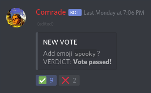
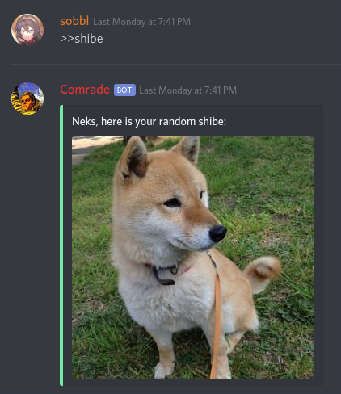
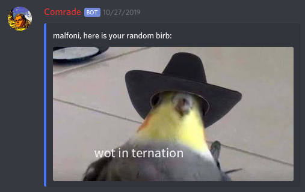

☭ Comrade Bot ☭
===

Usage Philosophy
---

Meet Comrade, a Discord bot who hands decision-making power back to the users themselves. Instead of a few moderators or an administrator choosing what your server needs, choices of this sort are now left up to the people. Want a custom emoji? Does someone need to be kicked or banned? Take a vote!

For the record, Comrade also has a couple of cute image commands, providing easy access to shibe or birb photos.

Invite Comrade!
---
<a href="https://discordapp.com/oauth2/authorize?client_id=592852914553487370&scope=bot&permissions=1413515334">Invite Link</a>

Screenshots
---

  
  

