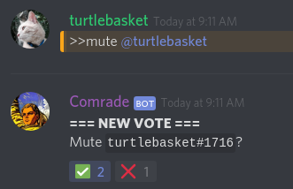

Karl Marx 2
===========
Karl Marx 2 takes a somewhat different spin on moderation for smaller servers (~10-35 users), handing the controls back to the users themselves. Instead of a single moderator issuing a command to mute, kick or even *ban* a given user, the choice is left up to anyone and everyone present in the channel. Is the user at hand being annoying or spammy enough to be muted? Are they toxic enough to be kicked/banned? Let's take a vote!  

I didn't have as much time as I would have liked to work on this, but even after Hack Week, I intend to progressively expand its abilities/scalability and even flesh out its functionality beyond just moderation and further improve it.

Made with love. [Enjoy!](https://discordapp.com/oauth2/authorize?client_id=592852914553487370&permissions=8&scope=bot) :)

Installation
------------
1. Clone the repo wherever you want and make sure you have python3 installed with the discord.py package. (If you don't then just `pip3 install discord.py` and you should be good to go!)
2. Grab the token of your frontend bot application and paste into `<path/to/bot>/token.txt`.
3. `python3 bot.py`

Commands
--------
- `>>manual` - Get ye some help
- `>>mute` - Hold a 30-second vote to mute a user for 10 minutes (minimum voters: 4, over 50% majority required). You can set different requirements in `config.json`.
- `>>kick` - Kick a user. The vote is up for 5 minutes, and requires that a minimum of 6 users and >50% approve.
- `>>exile` - Euphamism for banning a user, I guess. By default, the vote lasts 20 minutes, and requires that there be at least 8 votes and a 50% majority. Like the `>>mute` command, you can also tweak settings in `config.json`.
- `>>anthem` - First verse of the Soviet National Anthem. Might need that at some point to show your communist pride.
- `>>ping` - Fun leftovers from when I was first setting up the bot. :P
