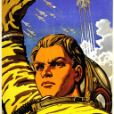
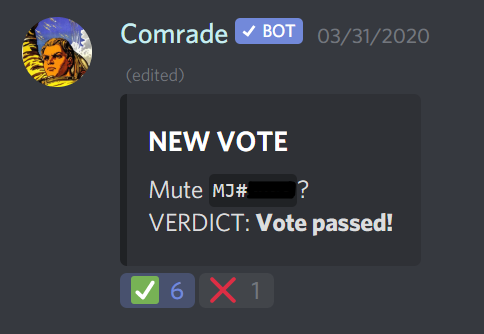
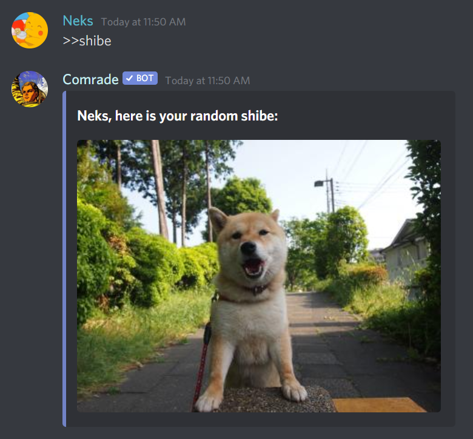

 
<h1>☭ Comrade Bot ☭</h1>
A communism-inspired discord bot who wants you to vote on everything. 
  

<h3><a href="https://discordapp.com/oauth2/authorize?client_id=592852914553487370&scope=bot&permissions=1413515334">Invite Comrade!</a></h3>

About/Design Philosophy
---

Meet Comrade, a Discord bot who hands decision-making power back to the users themselves. Instead of relying exclusively on a few moderators or an administrator to keep your server running, these choices now available to the people as well. Want a custom emoji? Does someone's toxicity warrant a temporary mute or kick? Take a vote!

Comrade also offers access to a couple of fun image commands, providing easy access to shibe or birb photos.

Basic Commands
---
- `>>help` - Get more detailed command instructions and bot info.
- `>>mute` - Hold a vote to mute a member for 10 minutes.
- `>>kick` - Hold a vote to kick a member.
- `>>ban` - Hold a vote to ban a member.
- `>>addEmote` - Hold a vote to add a proposed server emote (attached to your message as an image).
- `>>shibe`, `>>birb` - Post an image of the given entity in the current channel.
- `>>ping` - Test bot's server latency

  
  
   
  

